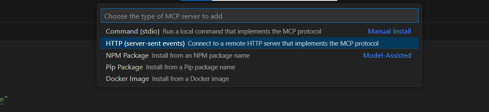
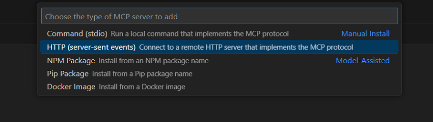
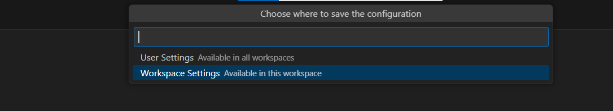
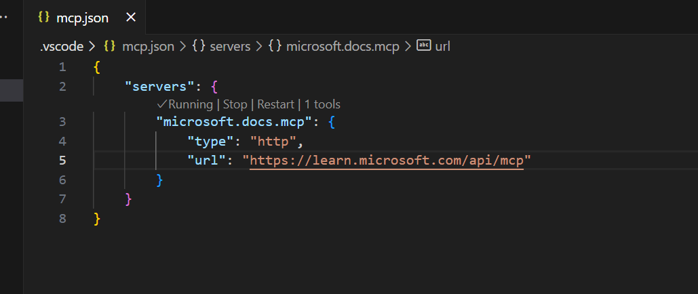

# 🌟 Microsoft Docs MCP Server
[](https://insiders.vscode.dev/redirect/mcp/install?name=microsoft.docs.mcp&config=%7B%22type%22%3A%22http%22%2C%22url%22%3A%22https%3A%2F%2Flearn.microsoft.com%2Fapi%2Fmcp%22%7D) [](https://insiders.vscode.dev/redirect/mcp/install?name=microsoft.docs.mcp&config=%7B%22type%22%3A%22http%22%2C%22url%22%3A%22https%3A%2F%2Flearn.microsoft.com%2Fapi%2Fmcp%22%7D&quality=insiders)

The Microsoft Docs MCP Server implements the [Model Context Protocol (MCP)](https://modelcontextprotocol.io) server that provides AI assistants with real-time access to official [Microsoft documentation](https://learn.microsoft.com).

> Please note that this project is in Public Preview and implementation may significantly change prior to our General Availability.

## 📑 Table of contents
1. [🎯 Overview](#-overview)
2. [🛠️ Currently Supported Tools](#%EF%B8%8F-currently-supported-tools)
3. [🌐 The Microsoft Docs MCP Server Endpoint](#-the-microsoft-docs-mcp-server-endpoint)
4. [🔌 Installation & Getting Started in VS Code](#-installation--getting-started-in-vs-code)
5. [🔗 Other MCP Clients](#-other-mcp-clients)
6. [❓ Troubleshooting](#-troubleshooting)
7. [🔮 Future Enhancements](#-future-enhancements)
8. [📚 Additional Resources](#-additional-resources)

## 🎯 Overview

### ✨ What is the Microsoft Docs MCP Server?

The Microsoft Docs MCP Server is a cloud-hosted service that enables MCP hosts like GitHub Copilot and Cursor to search and retrieve accurate information directly from Microsoft's official documentation. By implementing the standardized Model Context Protocol (MCP), this service allows any compatible AI system to ground its responses in authoritative Microsoft content.

### 📊 Key Capabilities

- **High-Quality Content Retrieval**: Search and retrieve relevant content from Microsoft Learn, Azure documentation, Microsoft 365 documentation, and other official Microsoft sources.
- **Semantic Understanding**: Uses advanced vector search to find the most contextually relevant documentation for any query.
- **Optimized Chunking**: Returns up to 10 high-quality content chunks (each max 500 tokens), with article titles, URLs, and self-contained content excerpts.
- **Real-time Updates**: Access the latest Microsoft documentation as it's published.

## 🌐 The Microsoft Docs MCP Server Endpoint

The Microsoft Docs MCP Server is accessible to any IDE, agent, or tool that supports the Model Context Protocol (MCP). Any compatible client can connect directly to the endpoint below:

**Endpoint URL:**
```
https://learn.microsoft.com/api/mcp
```

**Example JSON configuration:**
```json
{
  "servers": {
    "microsoft.docs.mcp": {
      "type": "http",
      "url": "https://learn.microsoft.com/api/mcp"
    }
  }
}
```

## 🛠️ Currently Supported Tools

| Tool Name | Description | Input Parameters |
|-----------|-------------|------------------|
| `microsoft_docs_search` | Performs semantic search against Microsoft official technical documentations | `query` (string): The search query for retrieval |

## 🔌 Installation & Getting Started in VS Code

### ⚡ Prerequisites

1. Install VS Code (either version):
   * [Stable release](https://code.visualstudio.com/download)
   * [Insiders release](https://code.visualstudio.com/insiders)
2. Open VS Code in any workspace

### 🚀 Installation Options

#### ✨ One-Click Installation

For the fastest setup, click one of these buttons to automatically install the Microsoft Docs MCP Server:

[](https://insiders.vscode.dev/redirect/mcp/install?name=microsoft.docs.mcp&config=%7B%22type%22%3A%22http%22%2C%22url%22%3A%22https%3A%2F%2Flearn.microsoft.com%2Fapi%2Fmcp%22%7D) [](https://insiders.vscode.dev/redirect/mcp/install?name=microsoft.docs.mcp&config=%7B%22type%22%3A%22http%22%2C%22url%22%3A%22https%3A%2F%2Flearn.microsoft.com%2Fapi%2Fmcp%22%7D&quality=insiders)
Just one click, and you're ready to go! 🎉

You might get prompted to open the link with VS Code and then select "Install Server".
Once you've installed the Microsoft Docs MCP Server, make sure you select GitHub Copilot Agent Mode and refresh the tools list. To learn more about Agent Mode, visit the [VS Code Documentation](https://code.visualstudio.com/docs/copilot/chat/chat-agent-mode).

#### 🔧 Manual Installation

For a step-by-step installation, follow these instructions:

1. Open VS Code's command palette by pressing `Ctrl + Shift + P` (Windows/Linux) or `Cmd + Shift + P` (Mac)

2. Type `MCP: Add Server...` and select it when it appears in the dropdown

3. Next select `HTTP (server-sent events)`



4. Enter the server URL: `https://learn.microsoft.com/api/mcp`



5. Provide a local name for the server (default or custom).

6. Choose Workspace as the save location.



7. A file named `mcp.json` will be created in the `.vscode` folder:
```
{
  "servers": {
    "microsoft.docs.mcp": {
        "type": "http",
        "url": "https://learn.microsoft.com/api/mcp"
    }
  }
}
```

8. If successful, you should be connected to the MCP server and see 1 tool available.



### 📝 Getting Started in VS Code

1. Open VS Code and [switch to Agent mode](https://code.visualstudio.com/docs/copilot/chat/chat-agent-mode).

2. Verify that the Microsoft Docs MCP Server (`microsoft.docs.mcp`) appears in the list of tools.

3. Test the server by prompting the agent with a query, e.g., "How to create an app service in Azure portal using microsoft docs?"

4. The agent should use the Microsoft Docs MCP Server to retrieve relevant documentation.

## 🔗 Other MCP Clients

The Microsoft Docs MCP Server is compatible with various MCP-supported clients. Here are quick installation options for popular clients:

### Cursor IDE

Install the Microsoft Docs MCP Server directly in Cursor with one click:

<a href="https://cursor.com/install-mcp?name=microsoft.docs.mcp&config=eyJ0eXBlIjoiaHR0cCIsInVybCI6Imh0dHBzOi8vbGVhcm4ubWljcm9zb2Z0LmNvbS9hcGkvbWNwIn0%3D"></a> <a href="cursor://anysphere.cursor-deeplink/mcp/install?name=microsoft.docs.mcp&config=eyJ0eXBlIjoiaHR0cCIsInVybCI6Imh0dHBzOi8vbGVhcm4ubWljcm9zb2Z0LmNvbS9hcGkvbWNwIn0="></a>

## ❓ Troubleshooting

### ⚠️ Common Issues

| Issue | Possible Solution |
|-------|-------------------|
| Connection errors | Verify your network connection and that the server URL is correctly entered |
| No results returned | Try rephrasing your query with more specific technical terms |
| Tool not appearing in VS Code | Restart VS Code or check that the MCP extension is properly installed |

### 🆘 Getting Support

For issues with the Microsoft Docs MCP Server:
- Check the [Model Context Protocol documentation](https://modelcontextprotocol.io)
- [Give us feedback](https://github.com/MicrosoftDocs/mcp/issues)
- Want to integrate the Learn MCP server with another product or service? [Contact us here](https://forms.office.com/r/MUHdB9CNx5)

## 🔮 Future Enhancements

The Microsoft Docs MCP Server team is working on several enhancements:

- Expanding coverage to additional Microsoft documentation sources
- Improved query understanding for more precise results

## 📚 Additional Resources

- [Model Context Protocol Specification](https://modelcontextprotocol.io)
- [VS Code MCP Documentation](https://code.visualstudio.com/docs/copilot/chat/mcp-servers)
- [Microsoft Learn](https://learn.microsoft.com)
